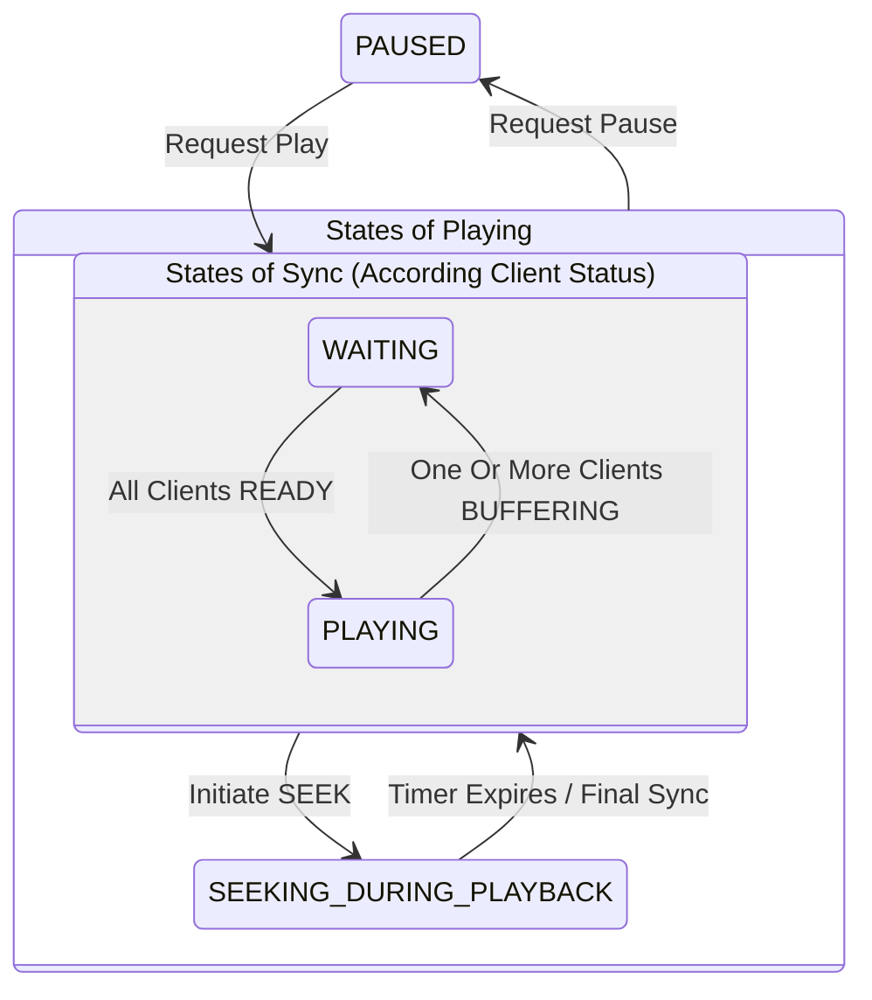

# Bunga Server

The backend core for **[bunga-player](https://github.com/joodo/bunga_player)**, enabling real-time synchronized video playback for multiple users across the globe.

## 📖 Overview

`bunga-server` handles the heavy lifting of state synchronization. When one user pauses, seeks, or plays a video in a room, this server ensures that every other participant stays perfectly in sync with millisecond precision.

## ✨ Features

- **Homepage**: A dedicated landing page providing project introduction and client download links.
- **Multi-instance Channel Management**: Robust handling of multiple concurrent sync sessions based on channel IDs.
- **Web-based Admin Console**: A centralized dashboard to configure service integrations (e.g., AList, Agora APIs, and tokens) and security preferences (e.g., toggling "Accept unknown clients").
- **Playback Synchronization**: Real-time coordination of playback progress and states across multiple clients for a seamless co-watching experience.

## 🛠️ Tech Stack

- **Runtime**: Python
- **Framework**: Django / Channels
- **Data Storage**: Redis, SQLite

## 🚀 Getting Started (TODO)

### Installation

1. **Clone the repository:**

```bash
git clone https://github.com/joodo/bunga-server.git
cd bunga-server

```

2. **Install dependencies:**

```bash
# If using npm
npm install

```

3. **Environment Configuration:**
   Create a `.env` file in the root directory:

```env
PORT=3000
CORS_ORIGIN=http://localhost:5173
# Add other variables here

```

### Running the Server

```bash
# Development mode
npm run dev

# Production mode
npm start

```

## 🔌 API & WebSocket Events (TODO)

### Connection

- **Endpoint**: `ws://your-server-ip:3000`

### Server-to-Client Events(TODO: API介绍)

| Event        | Payload                      | Description                                 |
| ------------ | ---------------------------- | ------------------------------------------- |
| `syncState`  | `{ isPlaying, currentTime }` | Broadcasts the master state to all members. |
| `userJoined` | `{ username, count }`        | Notifies users when someone new arrives.    |

## 📱 Integration with bunga-player

To connect your frontend instance to this server, ensure the `VITE_SERVER_URL` or equivalent config in [bunga-player](https://github.com/joodo/bunga_player) points to your deployment:

```env
# Example frontend .env
VITE_BUNGA_SERVER=https://api.yourdomain.com

```

## 🔄 Synchronization Logic

### Core Mechanism

1. **Authoritative Server**: The server is the single source of truth for media info, playback progress, and states (Play/Pause/Buffering).
2. **Remote Execution**: While client-side actions are treated as requests, with final execution governed by server commands, PAUSE and SEEK are executed locally upon client activation to ensure a seamless user experience.
3. **Silent Catch-up**: When a client's local progress drifts from the server, the following strategies apply:

| Drift (Threshold) | Strategy            | Description                                                                |
| ----------------- | ------------------- | -------------------------------------------------------------------------- |
| `< 400ms`         | **Ignore**          | Minor drift ignored to prevent jitter.                                     |
| `400ms - 2000ms`  | **Silent Catch-up** | Adjusts `playbackRate` to **0.95x** or **1.05x** until drift is `< 400ms`. |
| `> 2000ms`        | **Hard Sync**       | Immediate `seek` to the server's current timestamp.                        |

### Client States

Clients report their status to the server in real-time.

| State       | Description                                   |
| ----------- | --------------------------------------------- |
| `READY`     | Idle (no media) or sufficient buffer to play. |
| `BUFFERING` | Loading media or insufficient buffer.         |

### Server States

The server manages the global room state based on client feedback.

| State                     | Description                                                                                                                                                                                             |
| ------------------------- | ------------------------------------------------------------------------------------------------------------------------------------------------------------------------------------------------------- |
| `PAUSED`                  | Default/Paused state. Synchronization logic is suspended.                                                                                                                                               |
| `WAITING`                 | Triggered when any client reports `BUFFERING`. Other clients are instructed to pause and wait.                                                                                                          |
| `PLAYING`                 | Active playback. Progress is calculated based on playing start timestamp relative to the server clock.                                                                                                  |
| `SEEKING_DURING_PLAYBACK` | Active seeking by a client when playing (Note: Seeking while paused is treated as `PAUSED`). The server broadcasts the seek position; a 2-second cooldown timer is used before resuming mandatory sync. |



### Workflow

| Scenario          | Client Action                                                              | Server Action                                                                                                                                                                                                                                                                     |
| ----------------- | -------------------------------------------------------------------------- | --------------------------------------------------------------------------------------------------------------------------------------------------------------------------------------------------------------------------------------------------------------------------------- |
| **Join Room**     | Pulls current progress from server.                                        | If `PLAYING`, switches to `PAUSED` to tell others to wait.                                                                                                                                                                                                                        |
| **Buffer Update** | Reports `READY` or `BUFFERING` status.                                     | If server state is `BUFFERING` and **all** clients are `READY`, switches to `PLAYING` and broadcasts "Play".                                                                                                                                                                      |
| **Request Pause** | Sends pause notification with current position, and pause playback locally | Switches to `PAUSED` and broadcasts "Pause" to all clients.                                                                                                                                                                                                                       |
| **Request Play**  | Sends play request.                                                        | Switches to `PLAYING` (if all `READY`) or `BUFFERING`. <br/>Broadcasts command.                                                                                                                                                                                                   |
| **Client Seek**   | Seeks locally and notifies server.                                         | If not `PAUSED`, switches to `SEEKING_DURING_PLAYBACK`. <br/>Broadcasts the position and initiates a sync timer; on expiration, a `Force Sync` is triggered to align the playback progress across all clients. <br/>Playback progress will be synchronized to the slowest client. |
| **Force Sync**    | Syncs to the target timestamp.                                             | Broadcasts current authoritative position to all clients.                                                                                                                                                                                                                         |

## 📅 Roadmap (Upcoming)

- **NTP-based Clock Synchronization**: Implementing an NTP (Network Time Protocol) mechanism to align system clocks across all clients for high-precision playback control.

## 🤝 Contributing

Contributions are welcome! Please feel free to submit a Pull Request.

1. Fork the Project
2. Create your Feature Branch (`git checkout -b feature/AmazingFeature`)
3. Commit your Changes (`git commit -m 'Add some AmazingFeature'`)
4. Push to the Branch (`git checkout origin feature/AmazingFeature`)
5. Open a Pull Request

## 📄 License

This project is licensed under the GPL License - see the [LICENSE](LICENSE) file for details.

---

**Main Project:** [joodo/bunga_player](https://github.com/joodo/bunga_player)
