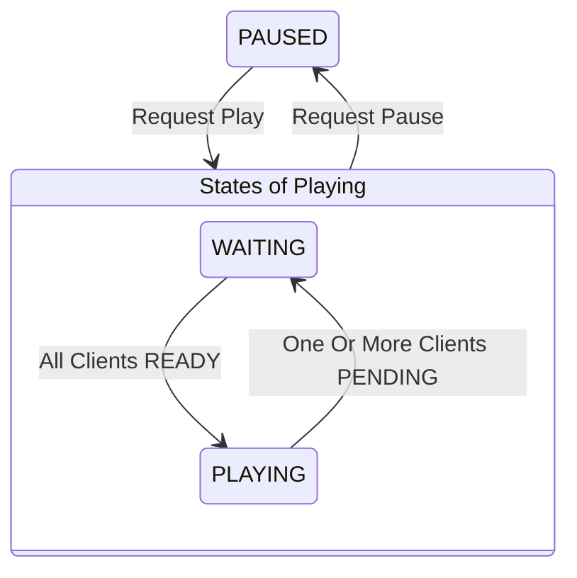

# Bunga Server

The backend core for **[bunga-player](https://github.com/joodo/bunga_player)**, enabling real-time synchronized video playback for multiple users across the globe.

## 📖 Overview

`bunga-server` handles the heavy lifting of state synchronization. When one user pauses, seeks, or plays a video in a room, this server ensures that every other participant stays perfectly in sync with millisecond precision.

## ✨ Features

- **Homepage**: A dedicated landing page providing project introduction and client download links.
- **Multi-instance Channel Management**: Robust handling of multiple concurrent sync sessions based on channel IDs.
- **Web-based Admin Console**: A centralized dashboard to configure service integrations (e.g., AList, Agora APIs, and tokens) and security preferences (e.g., toggling "Accept unknown clients").
- **Playback Synchronization**: Real-time coordination of playback progress and states across multiple clients for a seamless co-watching experience.

## 🛠️ Tech Stack

- **Runtime**: Python
- **Framework**: Django / Channels
- **Data Storage**: Redis, SQLite

## 🚀 Getting Started

### Prerequests

[Redis](https://redis.io/docs/latest/operate/oss_and_stack/install/archive/install-redis/) and [uv](https://docs.astral.sh/uv/#installation) are required.

### Installation

1. **Clone the repository:**

```bash
git clone https://github.com/joodo/bunga-server.git
cd bunga-server/bunga
```

2. **Configure Environment:**

Create your local settings file from the template and update the required credentials (DB, Secret Keys, etc.):

```bash
cp bunga/local_settings.template.py bunga/bunga/local_settings.py
nano bunga/local_settings.py  # Fill in the required information
```

3. **Deploy:**
   Create a `.env` file in the root directory:

```bash
chmod +x manage.sh
./manage.sh deploy
```

### Running the Server

```bash
./manage.sh start
```

### Update

```bash
git pull
./manage.sh deploy
```

## 🔌 API & WebSocket Events

### Restful API

- **Endpoint**: `http://your-server-ip:8000/api`

See [API view](/bunga/server/views/api.py) for more details.

### WebSocket

- **WebSocket**: `http://your-server-ip:8000/chat`

See [Schema File](/bunga/server/chat/schemas.py) for more details.

## 🔄 Synchronization Logic

### Client States

Clients report their status to the server in real-time.

| State     | Description                                   |
| --------- | --------------------------------------------- |
| `READY`   | Idle (no media) or sufficient buffer to play. |
| `PENDING` | Loading media or insufficient buffer.         |

### Server States

The server manages the global room state based on client feedback.

| State     | Description                                                                                            |
| --------- | ------------------------------------------------------------------------------------------------------ |
| `PAUSED`  | Default/Paused state. Synchronization logic is suspended.                                              |
| `WAITING` | Triggered when any client reports `PENDING`. Other clients are instructed to pause and wait.           |
| `PLAYING` | Active playback. Progress is calculated based on playing start timestamp relative to the server clock. |


```mermaid
stateDiagram-v2

    PAUSED --> PLAYINGGROUP : Request Play

    PLAYINGGROUP: States of Playing
    state PLAYINGGROUP {
        direction TB
        WAITING --> PLAYING : All Clients READY
        PLAYING --> WAITING : One Or More Clients PENDING
    }

    PLAYINGGROUP --> PAUSED : Request Pause

```

### Workflow

| Scenario          | Client Action                                                              | Server Action                                                                                              |
| ----------------- | -------------------------------------------------------------------------- | ---------------------------------------------------------------------------------------------------------- |
| **Join Room**     | Pulls current progress from server.                                        | If `PLAYING`, switches to `PAUSED` to tell others to wait.                                                 |
| **Buffer Update** | Reports `READY` or `PENDING` status.                                       | If server state is `PENDING` and **all** clients are `READY`, switches to `PLAYING` and broadcasts "Play". |
| **Request Pause** | Sends pause notification with current position, and pause playback locally | Switches to `PAUSED` and broadcasts "Pause" to all clients.                                                |
| **Request Play**  | Sends play request.                                                        | Switches to `PLAYING` (if all `READY`) or `PENDING`. <br/>Broadcasts command.                              |

## 📅 Roadmap (Upcoming)

- **NTP-based Clock Synchronization**: Implementing an NTP (Network Time Protocol) mechanism to align system clocks across all clients for high-precision playback control.

## 🤝 Contributing

Contributions are welcome! Please feel free to submit a Pull Request.

1. Fork the Project
2. Create your Feature Branch (`git checkout -b feature/AmazingFeature`)
3. Commit your Changes (`git commit -m 'Add some AmazingFeature'`)
4. Push to the Branch (`git checkout origin feature/AmazingFeature`)
5. Open a Pull Request

## 📄 License

This project is licensed under the GPL License - see the [LICENSE](LICENSE) file for details.

---

**Main Project:** [joodo/bunga_player](https://github.com/joodo/bunga_player)
